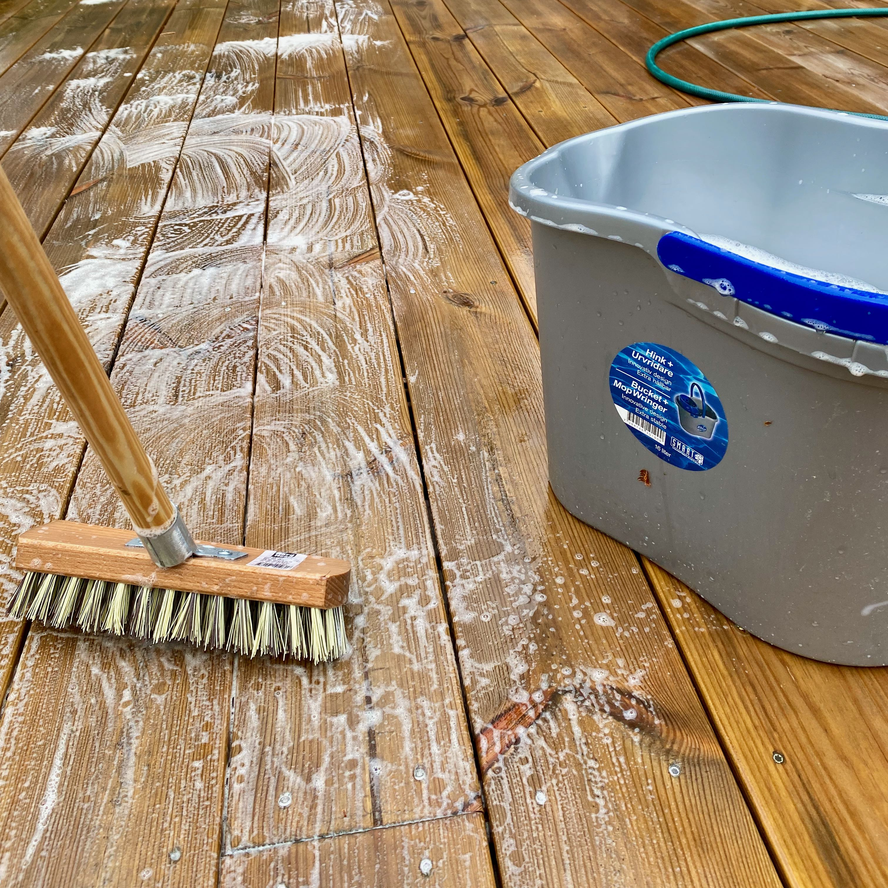
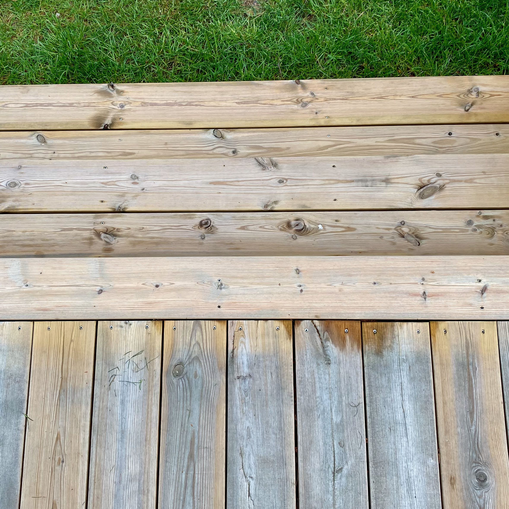
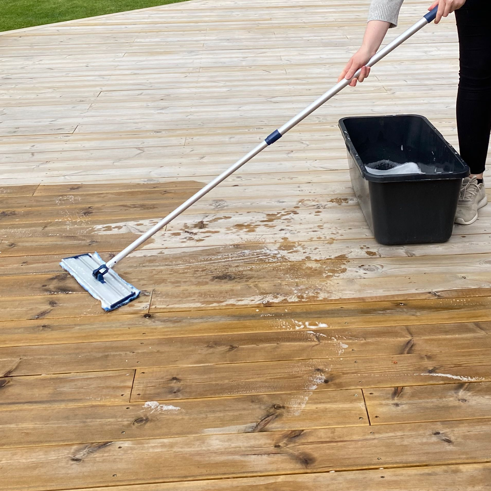

# Skura altanen

Som så många andra har vi en klassisk altan i tryckimpregnerat virke på baksidan av huset mot trädgården. Här följer lite information om underhåll och dylikt.

## Rengöring och behandling

Eftersom vi har en del björkar och tallar runt altanen och huset så får vi en hel del avfall från dem. Därmed har vi valt att behandla våran altan med såpa istället för olja, med en överfettad såpa. Anledningen är att olja ger en fet yta där pollen och annat avfall lätt fastnar vilket inte lämpar sig i vårt fall. Såpa däremot ger en mer matt och len yta där smuts inte fastnar lika lätt. Dessutom är det ett mer miljövänligt alternativ. Processen kring att såpa ett golv fins att läsa hos [Västerbotten såpa](https://vasterbottenssapa.se/hur-sapar-man-tratrall/) men en kort summering följer nedan.

Stegen som krävs:
- Göra rent
- Slipa
- Behandla

Vad som behövs:
- En hink för såpablandningen
- En levang/skurborste. Alternativt en skurmasking, vi använder en Kärcher PCL 4. 
- En mopp eller skurtrasa att sprida ut såpavattnet med
- Sandpapper. Ett ledat slipverktyg är till stor hjälp
- Överfettad såpa, vi valde [Gysingesåpa](https://www.gysinge.com/products/5806/gysinges%C3%A5pa-5-liter).
- Såpa för rengöring. Här kan man använda samma överfettade såpa som till behandlingen men det är mer ekonomiskt att använda sig av vanlig gränsåpa här, t.ex. Grumme.

Vårt mål är att behandla altanen minst en gång om året, under våren.

### Gör rent altanen

Eftersom såpan ska tränga ner i träet är det bra om altanten fått torka upp samt att det är en mulen dag så att solen inte gör att det avdunstar för snabbt.

1. Sopa först av hela altanen från grov smuts, damm och dylikt.
1. Blanda såpa + vatten enligt anvisning för rengöring. I vårt fall har det varit 1DL Såpa per 10L vatten.
1. Blötlägg en sektion eller ett par trallrader med vattenslangen.
1. Började därefter skrubba hela sektionen/trallraden.
1. Skölj av ytan och börja på nästa sektion.

När hela altanen skrubbats kan du avsluta med att skölja av hela och låta det torka för att inspektera att all smuts är borta.

Så här såg vår altan ut före och efter rengöring. Som ni ser är den gråa beläggningen helt borta och den ser fräsch och fin ut igen.

### Behandla altan

När altanen är ren är det dags att behandla den, detta görs med kallt vatten + såpa.

1. Se till att altanen är ren och är torr.
1. Blanda 1 del såpa med 10 delar kallt vatten i skurhinken
1. Dränk skurtrasan i hinken, lägg den sedan över lavangen och gå över hela altanen med den.
1. Låt torka och upprepa för en lenare yta tills att du känner dig nöjd.

